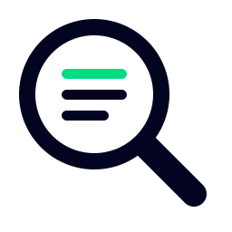

<p align="center">
  
</p>

<h1 align="center">nuxt-spyglass</h1>

[![npm version][npm-version-src]][npm-version-href]
[![npm downloads][npm-downloads-src]][npm-downloads-href]
[![License][license-src]][license-href]
[![Nuxt][nuxt-src]][nuxt-href]

> Capture **browser and server logs in one correlated place** - and let your AI agent read them over MCP.

**Logs save the world** - and with AI even more so: errors get understood faster, even when they're messily formatted. The only thing in the way is the **server–browser divide**. You end up gathering logs by hand, or your AI spins up its own Nuxt dev server just to see them - exactly what you don't want.

`nuxt-spyglass` listens to **all** logs - Nitro (server) *and* browser, plain debug logs as well as thrown errors - in **one** source.

And it goes further: related events are tied together by a shared id. So when an error happens during a route change, you can - at best - see the browser logs **connected to** the Nitro errors thrown at that very moment. That makes debugging dramatically easier.

To put those logs into your AI's hands, Spyglass ships a lightweight **stdio MCP server**. Stop copy-pasting logs between terminals and tabs, or trawling through separate sources - let Spyglass and your AI agent handle it.

`nuxt-spyglass` is a **dev-only** module and disables itself completely in production. Zero config: install, start your dev server, connect your AI - done.

## Features

- 🌐🖥️ Unified **browser + server** logs in a single NDJSON file
- 🔗 **Correlation** across the boundary via `pageLoadId` (per page load) and `requestId` (per request)
- 💥 Captures `console.*`, uncaught errors, unhandled rejections and server throws - **with real stack traces**
- 🤖 Built-in **stdio MCP server** so AI agents can query your logs
- 👀 Built-in **terminal log viewer** (`npx nuxt-spyglass`) for humans - live tail, colors, search
- 🚫 **Dev-only** - a no-op in production, zero cost in your build

## Quick Setup

Install it as a dev dependency:

```bash
npx nuxt module add nuxt-spyglass
# or
pnpm add -D nuxt-spyglass
```

Add it to your Nuxt config:

```ts
export default defineNuxtConfig({
  modules: ['nuxt-spyglass'],
})
```

Start your dev server - that's it. Logs are written to `.data/spyglass/logs.ndjson` (already covered by the default `.gitignore`).

## Configuration

```ts
export default defineNuxtConfig({
  modules: ['nuxt-spyglass'],

  spyglass: {
    // Master switch. Always off in production builds, regardless of this value.
    enabled: true,
    // NDJSON log file; relative paths resolve against the project root.
    logFile: '.data/spyglass/logs.ndjson',
  },
})
```

## How it works

- **Browser:** a client plugin wraps `console.*` and listens for `error` / `unhandledrejection`, buffers entries and ships them to a Nitro endpoint.
- **Server:** a consola reporter plus a Nitro `error` hook capture server logs and unhandled errors - with their original stack.
- Everything lands in one **NDJSON** file through a single write queue.
- **Correlation:** each page load carries a `pageLoadId` (injected during SSR, sent back to the server on same-origin requests); each server request gets its own `requestId`. Browser and server entries of the same page load therefore share one id.

## 👀 Live log viewer (CLI)

A built-in terminal viewer for **you** (the human) - run it in a second terminal next to your dev server:

```bash
npx nuxt-spyglass                  # uses .data/spyglass/logs.ndjson in the current folder
npx nuxt-spyglass <path-to-logs>   # or point it at the file explicitly
```

When the module starts in dev it also prints the exact command (with the resolved path), so you can just copy-paste it.

- Live tail, newest at the bottom, auto-follows; scroll with `↑/↓`, `PageUp/Down`, `Home/End`, or the mouse wheel
- **Browser + server logs interleaved**, colored by level, framework noise dimmed
- **`/`** to search - jump to a hit, which briefly highlights
- **`q`** or `Ctrl+C` to quit

## 🔭 AI access (MCP)

Spyglass ships `nuxt-spyglass-mcp`, a lightweight **stdio MCP server** that reads your log file and exposes it to AI agents.

**How it works - read this first:**

- Your AI agent **launches the MCP server itself** - you never run it manually or keep it running.
- Keep your **Nuxt dev server running** (it produces the logs); the MCP server only reads the file on demand.
- After registering the server, **start a new agent session** so the tools load.

The server takes the path to your log file as its only argument (use an absolute path). `nuxt-spyglass-mcp` is a binary **inside** the `nuxt-spyglass` package, so launch it with `npx -p nuxt-spyglass nuxt-spyglass-mcp …` (or `node …/node_modules/nuxt-spyglass/dist/mcp.mjs …`).

> 💡 Easiest: when the module starts in dev it **logs the exact, fully-resolved command** - just copy that.

**Tools**

| Tool | What it returns |
| --- | --- |
| `recent_errors` | The most recent errors, browser and server |
| `recent_logs` | Recent logs, optionally filtered by level, source or start time |
| `logs_for_page` | Every log of one page load by `pageLoadId` - the full correlated tree |
| `search` | Case-insensitive substring search across messages |
| `logs_since_last_check` | Only what arrived since the previous call - to see what changed after an action (e.g. after editing code) |

Framework noise (Vue warnings, devtools, build lifecycle) is excluded by default; pass `includeNoise: true` to any tool to see everything.

### Claude Code

```bash
claude mcp add spyglass -- \
  npx -p nuxt-spyglass nuxt-spyglass-mcp /abs/path/to/your-app/.data/spyglass/logs.ndjson
```

Then run `/mcp` in a new session to confirm `spyglass` is connected.

### Codex

In `~/.codex/config.toml`:

```toml
[mcp_servers.spyglass]
command = "npx"
args = ["-p", "nuxt-spyglass", "nuxt-spyglass-mcp", "/abs/path/to/your-app/.data/spyglass/logs.ndjson"]
```

### GitHub Copilot (VS Code)

In `.vscode/mcp.json`:

```json
{
  "servers": {
    "spyglass": {
      "type": "stdio",
      "command": "npx",
      "args": ["-p", "nuxt-spyglass", "nuxt-spyglass-mcp", "/abs/path/to/your-app/.data/spyglass/logs.ndjson"]
    }
  }
}
```

Once connected, just ask your agent things like *"use spyglass to show the recent errors"* or *"get the logs for pageLoadId …"*.

## 🧩 evlog integration

Using [evlog](https://evlog.dev) for structured logging? Spyglass captures it automatically - no extra setup. evlog emits one structured *wide event* per request through its `evlog:drain` Nitro hook; Spyglass listens on that hook and reads the **structured event directly**, so it works even with evlog's default (console-less) setup.

- Each per-request `log.info/warn(...)` becomes its own entry.
- The wide event becomes a request summary (`[evlog] GET /api/x -> 200`) carrying evlog's fields and the error stack.
- Entries are correlated into the same `pageLoadId`/`requestId` as the rest of the page load.

**Browser-side evlog logs** are captured too, once you enable evlog's transport so they reach the server:

```ts
export default defineNuxtConfig({
  modules: ['nuxt-spyglass', 'evlog/nuxt'],
  evlog: { transport: { enabled: true } },
})
```

Spyglass never imports evlog - if evlog isn't installed, the hook simply never fires.

## Contribution

<details>
  <summary>Local development</summary>

  ```bash
  # Install dependencies
  pnpm install

  # Generate type stubs
  pnpm dev:prepare

  # Develop with the playground
  pnpm dev

  # Build the module (including the MCP bin)
  pnpm prepack

  # Run ESLint
  pnpm lint

  # Run Vitest
  pnpm test
  ```

</details>

<!-- Badges -->
[npm-version-src]: https://img.shields.io/npm/v/nuxt-spyglass/latest.svg?style=flat&colorA=020420&colorB=00DC82
[npm-version-href]: https://npmjs.com/package/nuxt-spyglass

[npm-downloads-src]: https://img.shields.io/npm/dm/nuxt-spyglass.svg?style=flat&colorA=020420&colorB=00DC82
[npm-downloads-href]: https://npm.chart.dev/nuxt-spyglass

[license-src]: https://img.shields.io/npm/l/nuxt-spyglass.svg?style=flat&colorA=020420&colorB=00DC82
[license-href]: https://npmjs.com/package/nuxt-spyglass

[nuxt-src]: https://img.shields.io/badge/Nuxt-020420?logo=nuxt
[nuxt-href]: https://nuxt.com
